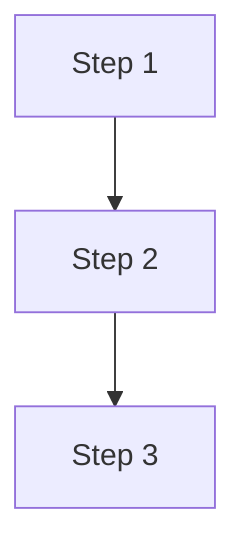

# Visual Designer

Create infographics and diagrams that look like magazine spreads, not web dashboards.

## Before Designing

Read `knowledge-base/visual-design-guide.md` for the full ruleset. Key principles:
- Tufte: maximize data-ink, kill chart junk
- Poster layout, not web layout
- 4-6px strokes, 36px+ headlines, 3-4 colors, sharp corners
- If removing an element doesn't lose information, remove it

If a design profile exists at `training/references/design-profile.md`, use those colors and fonts.

Read `_ops/skills/visual-designer/references/text-measurement.md` for the character width tables. **Every SVG with text MUST compute column widths from character counts before placing elements.** No eyeballing x positions.

## Workflow

### Step 1: Determine what structure to show

Ask: what RELATIONSHIP does this visual communicate?
- **Flow/graph** → nodes + edges, satellite inputs/outputs (see Graph Layout below)
- **Comparison** → two columns, same structure, differences highlighted (use grid + measurement)
- **Hierarchy** → tree or nested
- **Timeline** → horizontal with key dates
- **Stats** → big numbers with context
- **Feature matrix** → rows/columns with check/cross

If the content is just a list of tips with no structural relationship, DON'T make an infographic. Say so: "This is better as text. A visual would just be a styled list, which wastes the reader's time."

### Step 2: Draft in Mermaid

Write a Mermaid code block first. This nails the logic before any design:



Show the user. Confirm the structure is right. Fix logic before making it pretty.

**Render Mermaid to SVG** (use the auto-layout — don't skip this):
```bash
npx --yes @mermaid-js/mermaid-cli -i input.mmd -o output.svg -t dark -b transparent
```

The Mermaid renderer has spatial reasoning you don't have. It places nodes so connections don't cross. TRUST THE LAYOUT. Do not manually reposition nodes in SVG unless the Mermaid output has a specific visual problem.

**CRITICAL LESSON**: Never skip the Mermaid render and go straight to hand-placed SVG coordinates. You cannot see the result. You will create crossing lines, awkward routes, and confusing layouts. Mermaid handles node placement. You handle branding AFTER the layout is proven.

If the Mermaid render is clear enough as-is (for Obsidian, Notion, inline docs), SHIP IT. Don't add a branding pass unless the destination requires it.

### Step 3: Brand the SVG (optional, only if Mermaid output needs polish)

If the Mermaid SVG needs branding for a specific destination (social, presentation, print), use the Mermaid layout as the COORDINATE BLUEPRINT — read the node positions, recreate with branded typography and colors.

For hand-crafted SVGs (comparison tables, stat cards — things Mermaid can't do), follow these rules STRICTLY:

**Canvas**: explicit width/height viewBox. Common sizes:
- Newsletter inline: 800×600
- Social image: 1200×630
- Presentation slide: 1920×1080
- Tall infographic: 800×1200

**Typography** (embed via Google Fonts @import in `<style>`):
- Headlines: 36-72px, bold condensed (Oswald, Bebas Neue, Anton)
- Body: 18-24px, clean (Inter)
- Labels: 14-16px, uppercase, letterspaced, mono (Space Mono)
- NOTHING under 12px

**Layout**:
- Thick dividers between sections (4-6px)
- Large bold step numbers (48px+)
- Asymmetric — don't center everything
- White space is intentional zones, not leftover gaps

**Color**: 3-4 max. High contrast. Default: cream #F0E8D4, charcoal #1a1a1a, orange #E8682A, red #C0392B

**Lines and shapes**:
- stroke-width: 4 minimum, 6 preferred
- No rounded corners on containers (border-radius: 0)
- Arrows: thick, with clear heads
- No drop shadows, no gradients, no 3D

### Graph Layout Mode (flowcharts, pipelines, system diagrams)

NOT a grid of uniform boxes. A graph with nodes of different sizes and connections from any angle.

**Node types:**
- **Primary node** (skill/action): large box, 200-280w × 70-90h, bold title + description
- **Input node** (data source): small pill, 120-160w × 36h, just a label. Feeds INTO a primary.
- **Output node** (destination): small pill, same size. Comes OUT of a primary.
- **Decision node**: diamond shape, "approve?" branch
- **Annotation**: floating label on a connection line, no box

**Layout principles:**
- Primary nodes form the SPINE (main flow path). The spine can snake, not just L-R.
- Input nodes sit ABOVE or to the LEFT, connected by thin arrows (2-3px)
- Output nodes sit BELOW or to the RIGHT, connected by thin arrows
- Different node sizes = visual hierarchy. Big = action. Small = data source/destination.
- Connections can come from ANY angle. Not locked to horizontal/vertical.

**Connections:**
- Main flow: thick arrows (4-6px), dark
- Satellite (input/output): thin arrows (2-3px), colored
- Feedback loops: dashed lines
- Labels directly on the connection line

**Anti-patterns for graphs:**
- All boxes same size (that's a grid, not a graph)
- All connections horizontal/vertical only (that's web layout)
- Hiding inputs/outputs in the box description instead of showing them as separate nodes
- Forcing a fixed canvas size before knowing the graph shape

**Canvas:** let the graph determine the size. Draft at natural proportions, crop for destination.

### Step 4: Self-review

Before showing the user, check:
- [ ] Readable at 50% zoom? (simulates thumbnail/social preview)
- [ ] Every element carries information? (Tufte test)
- [ ] Fewer than 8 items? (split if more)
- [ ] No text under 12px?
- [ ] No thin lines under 4px?
- [ ] 3-4 colors max?
- [ ] Looks like a poster, not a website section?

### Step 5: Render

Save SVG to `output/visuals/[name].svg`

For PNG conversion (newsletter/social embed):
```bash
node --input-type=module -e "
import puppeteer from 'puppeteer';
const browser = await puppeteer.launch({headless:'new'});
const page = await browser.newPage();
await page.setViewport({width:WIDTH,height:HEIGHT,deviceScaleFactor:2});
await page.goto('file:///path/to/visual.svg',{waitUntil:'networkidle0'});
await new Promise(r=>setTimeout(r,1000));
await page.screenshot({path:'output/visuals/NAME.png',omitBackground:true});
await browser.close();
"
```

## Rules
- Mermaid FIRST for structure, SVG SECOND for beauty. Never skip the draft.
- Read the visual design guide before every generation.
- If the content doesn't have structural relationships, refuse to make an infographic. Text is better.
- Self-review is mandatory. Never show unreviewed work.
