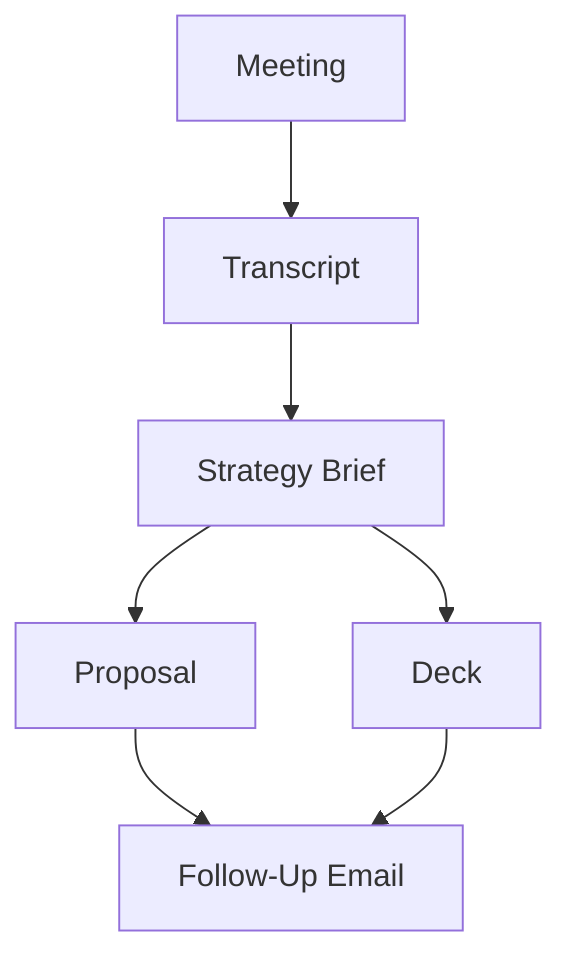

# Visual Design Guide — Infographics, Diagrams, and Data Visualization

Reference doc for any skill that generates visual content. Applies to: newsletter visuals, session diagrams, flowcharts, comparison tables, process maps, data charts.

## The Problem We Keep Having

AI-generated visuals default to "website section" aesthetics: thin lines, rounded corners, subtle gradients, centered layout, pastel colors. These are illegible at small sizes, lack hierarchy, and look like every other AI output.

Good infographics look like POSTERS, not web pages.

## Three Output Tiers

### Tier 1: Mermaid (draft, structure-first)

Use for: flowcharts, sequences, mind maps, process diagrams. Renders in Obsidian, GitHub, Notion.

Rules:
- Use for LOGIC, not beauty. Mermaid's rendering is clean but not branded.
- Maximum 30 nodes. Split complex diagrams.
- Use meaningful labels, not A → B → C.
- Direction: TD (top-down) for processes, LR (left-right) for timelines.

### Tier 2: SVG (production, branded)

Use for: newsletter infographics, session diagrams, social images, presentation visuals.

SVG gives full control: exact placement, custom fonts, brand colors, thick lines, bold type. No CSS layout engine opinions.

**Mandatory SVG rules:**

Typography:
- Headlines: 36-72px, bold/black weight, condensed sans (Oswald, Bebas Neue, Anton)
- Body: 18-24px, clean readable (Inter, system sans)
- Labels: 12-16px, uppercase, letterspaced, mono (Space Mono, JetBrains Mono)
- NO text smaller than 12px. If it's not readable at thumbnail size, it shouldn't exist.

Layout:
- Sections divided by THICK lines (4-6px strokes, not 1px hairlines)
- Numbered steps with large bold numbers (36px+) 
- Icons as simple geometric shapes, not detailed illustrations
- Maximum 5-7 items per visual. If more, split into multiple graphics.
- Asymmetric layout preferred over centered-everything

Color:
- Maximum 3-4 colors per infographic
- High contrast: dark on light OR light on dark. Never medium-on-medium.
- Use the design profile if one exists (`training/references/design-profile.md`)
- Default warm palette: cream #F0E8D4, charcoal #1a1a1a, orange #E8682A, red #C0392B

Data-Ink Ratio (Tufte):
- Every pixel should represent information. If removing an element doesn't lose data, remove it.
- No decorative borders, shadows, gradients, or background patterns that don't carry meaning.
- No 3D effects on charts. Ever. 2D only.
- Gridlines: remove or make nearly invisible. The data speaks.
- Labels on the data itself, not in a separate legend (when possible).

Structure types:
- **Process flow**: numbered steps, left-to-right or top-to-bottom, arrows between steps
- **Comparison**: two columns, same structure, differences highlighted
- **Hierarchy**: tree or nested boxes, parent-child relationships
- **Timeline**: horizontal, key dates with labels above/below the line
- **Stats/numbers**: big number centered, context label below
- **Checklist**: numbered or checkmarked items, one column

### Tier 3: Polished Infographic (hero visual)

For newsletter headers, social hero images, presentation title cards. Use SVG but with the full design philosophy applied.

Start with Tier 2 SVG rules, then add:
- Branded color palette from design profile
- Custom typography (Google Fonts embedded in SVG)
- Geometric accents (circles, diagonal lines, stripes — from floppy label aesthetic)
- Subtle texture or grain for warmth (CSS filter or SVG pattern)

This tier should feel like a magazine spread, not a dashboard widget.

## Anti-Patterns (what goes wrong)

| Bad Pattern | Why | Fix |
|---|---|---|
| Thin 1px lines | Invisible at small sizes, looks like a wireframe | 4-6px minimum strokes |
| Rounded corners on everything | Looks like a web component, not an infographic | Sharp corners. Rectangles. |
| Centered layout with even spacing | Looks like a landing page section | Asymmetric, bold hierarchy |
| 8+ colors | Rainbow chaos, no hierarchy | 3-4 colors max |
| Small text labels (10px) | Can't read in newsletter or social thumbnail | 12px minimum, 16px preferred |
| Gradients and shadows | Decorative noise, reduces data-ink ratio | Flat colors, solid fills |
| Icons from icon libraries | Look generic, same as every AI tool | Simple geometric shapes or skip |
| "Infographic" that's really a bullet list with icons | Not a visualization, just styled text | Only make a visual if there's actual STRUCTURE to show |

## When NOT to Make a Visual

- If the content is a list of tips → just write the list. Don't force it into an infographic.
- If the data has no relationships → a paragraph is clearer than a diagram.
- If there are fewer than 3 items → text is faster to consume.
- Visuals earn their existence by showing STRUCTURE: flows, comparisons, hierarchies, timelines. Not by making text look fancier.

## Generating with Mermaid First, SVG Second

Best workflow for any visual:
1. **Draft in Mermaid** — get the structure right. Nodes, connections, labels.
2. **Review the logic** — does the flow make sense? Anything missing?
3. **Convert to SVG** — apply brand colors, proper typography, thick lines, bold layout.
4. **Self-review** — would this be readable as a LinkedIn post thumbnail? If not, simplify.

## Sources and Principles

- Edward Tufte: maximize data-ink ratio, minimize chart junk, graphical integrity
- Mermaid.js: text-to-diagram rendering (mermaid.js.org)
- SVG spec: resolution-independent, font-embeddable, no layout engine opinions
- Floppy label designer rules: same bold/thick/warm aesthetic applies to infographics
